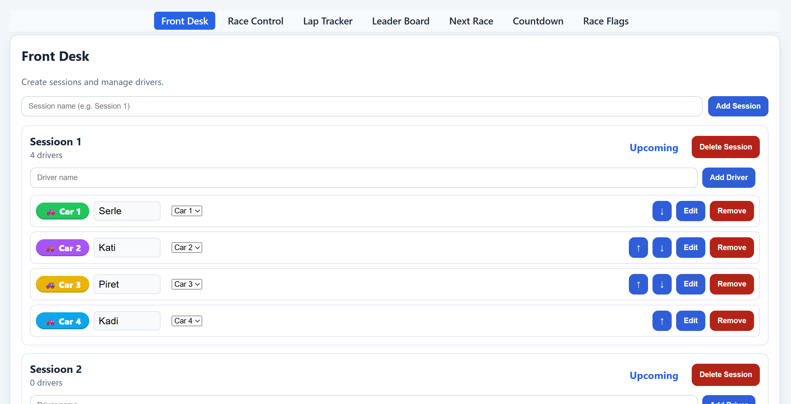
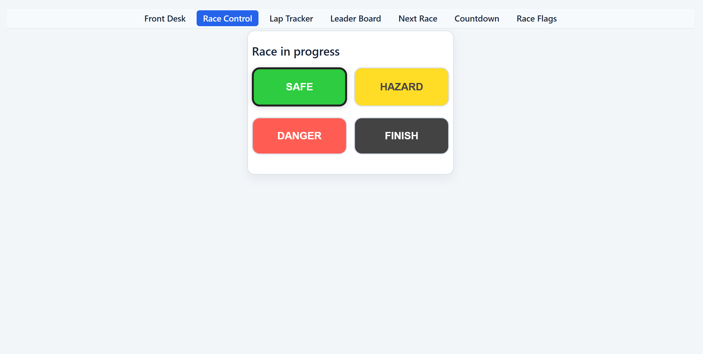
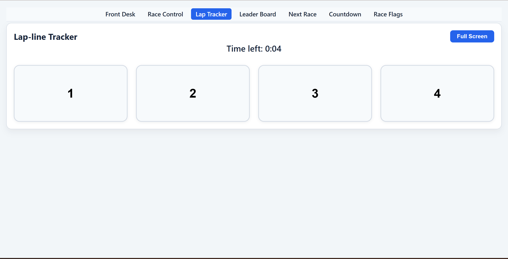
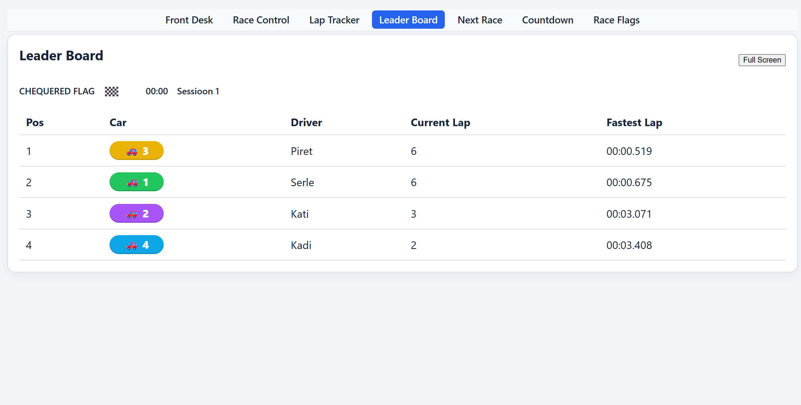
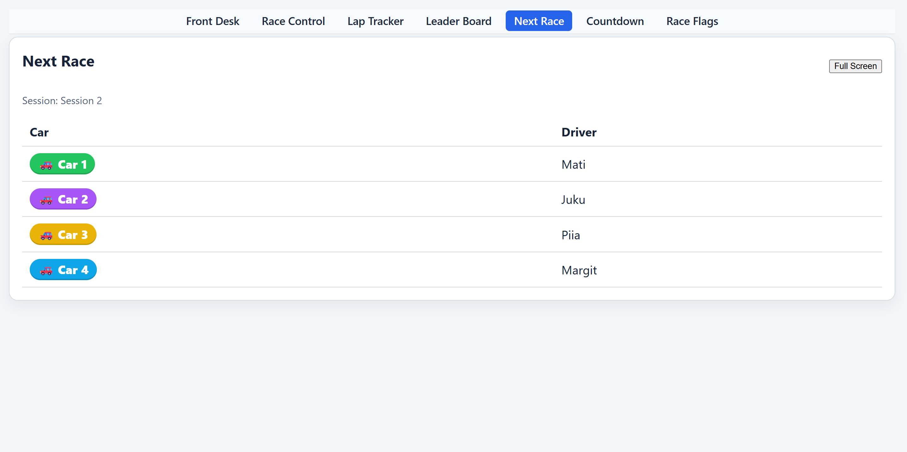
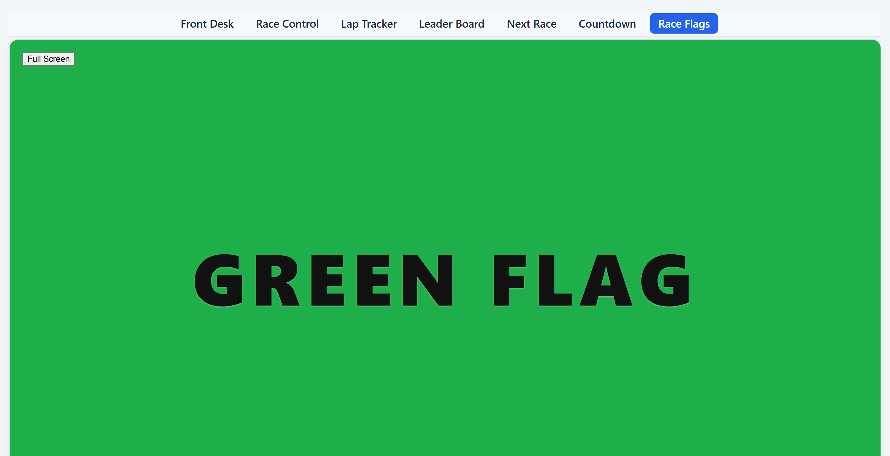

# Racetrack Info Screens

Team: **Motivaatorid**  
//kood 2026 team project

## Project Goal
Deliver a robust racetrack MVP:
- Employees: dedicated interfaces for race operations
- Audience: live race info screens
- Server: single source of truth, state persists across restarts
- Shared: TypeScript contracts for all events/state

---

## Workspace Structure

```
Racetrack_Motivaatorid/
├── client/           # React app (Vite, TypeScript)
│   ├── src/
│   │   ├── features/ # UI panels by domain (frontDesk, raceControl, ...)
│   │   ├── routes/   # Route entrypoints (one per main view)
│   │   ├── layouts/  # Layout wrappers (EmployeeLayout, PublicLayout)
│   │   ├── lib/      # Shared client utilities (socket, carColors)
│   │   └── hooks/    # React hooks (useRaceState)
│   └── ...
├── server/           # Node.js backend (Express, Socket.IO, TypeScript)
│   ├── src/
│   │   ├── services/ # Business logic (sessionService, lapService, ...)
│   │   ├── socket/   # Socket.IO handlers, auth
│   │   ├── state/    # Persistence, state store
│   │   └── config/   # Env config
│   └── ...
├── shared/           # Shared types and event contracts
├── screenshots/      # Screenshots/GIFs for README (see section below)
├── .env.example      # Example environment variables
├── README.md         # This file
└── USER_GUIDE.md     # Detailed user guide
```

---

## Routes & Views

| URL                  | React Component         | Description                       |
|----------------------|------------------------|-----------------------------------|
| /front-desk          | FrontDeskPanel         | Receptionist: manage sessions     |
| /race-control        | RaceControlPanel       | Safety: control race/flags        |
| /lap-line-tracker    | LapTrackerPanel        | Observer: record laps             |
| /leader-board        | LeaderBoardPanel       | Public: live leaderboard          |
| /next-race           | NextRacePanel          | Public: next race info            |
| /race-countdown      | CountdownPanel         | Public: countdown timer           |
| /race-flags          | RaceFlagsPanel         | Public: current flag color        |

---

## Team

- Serle Tali  
- Piret Maricic  
- Kati-Helen Peegel  
- Kadi Kerner (Team Lead)

---


# Screenshots


| Interface         | Screenshot Filename                  | Caption                        |
|-------------------|-------------------------------------|--------------------------------|
| Front Desk        | screenshots/front-desk.png           | Front Desk: Manage sessions    |
| Race Control      | screenshots/race-control.png         | Race Control: Start & control race |
| Lap-line Tracker  | screenshots/lap-line-tracker.png     | Lap-line Tracker: Record laps  |
| Leader Board      | screenshots/leader-board.png         | Leader Board: Live standings   |
| Next Race         | screenshots/next-race.png            | Next Race: Upcoming session    |
| Race Flags        | screenshots/race-flags.png           | Race Flags: Current flag color |

<!-- Example screenshot links (uncomment after adding images)






-->

# 1. Tech Stack

- **Server:** Node.js, Express, Socket.IO, TypeScript  
- **Client:** React, Vite, TypeScript  
- **Shared:** TypeScript shared types and event contracts  
- **State persistence:** JSON autosave

---

# 2. Requirements

- Node.js 20+  
- npm 10+

---


# 3. Environment Variables


## Client-server connection (multi-device support)

To allow connecting from other devices (phone, tablet, etc), set the client environment variable:

```
VITE_SERVER_URL=http://your-server-ip:3000
```

If not set, the client will auto-detect the server based on the browser's hostname.

See [.env.example](./client/.env.example) for usage. Copy it to `client/.env` and fill in your own values if needed.

---

The server will not start unless all required access keys are provided.


### Server CORS configuration

To control which client origins are allowed to connect to the server (CORS), set the environment variable:

```
ALLOWED_ORIGINS=http://localhost:5173,http://your-prod-url
```

Use a comma-separated list for multiple origins. To allow all origins (not recommended for production), use:

```
ALLOWED_ORIGINS=*
```

If not set, defaults to '*'.

See [.env.example](./.env.example) for all required and optional variables. Copy it to `.env` and fill in your own values.

Example for Linux/macOS:
```bash
cp .env.example .env
export RECEPTIONIST_KEY=your_key
export SAFETY_KEY=your_key
export OBSERVER_KEY=your_key
```
Example for Windows (cmd):
```cmd
copy .env.example .env
set RECEPTIONIST_KEY=your_key
set SAFETY_KEY=your_key
set OBSERVER_KEY=your_key
```
Example for Windows (PowerShell):
```powershell
Copy-Item .env.example .env
$env:RECEPTIONIST_KEY="your_key"
$env:SAFETY_KEY="your_key"
$env:OBSERVER_KEY="your_key"
```
export RACE_DEV_MODE=true   # Enable 1-minute dev timer
```

Example for Windows PowerShell:

```powershell
$env:RECEPTIONIST_KEY="your_key"
$env:SAFETY_KEY="your_key"
$env:OBSERVER_KEY="your_key"
$env:RACE_DEV_MODE="true"   # Enable 1-minute dev timer
```

If any variable is missing, the server exits with an error and prints usage instructions.

---

# 4. Installation

Install all dependencies:

```bash
npm install
```


# 5. Development

Start both server and client in watch mode:

```bash
npm run dev
```

This launches:

- the server (TypeScript watch mode),
- the client (Vite dev server).

---

## External access (ngrok)

To open the app on your phone or another network:

1. Start the client: `npm run dev`
2. In a new terminal: `npx ngrok http 5173`
3. Open the generated https://...ngrok-free.dev link on your device.

Make sure `.ngrok-free.dev` is in `allowedHosts` in `client/vite.config.ts`.

---

# 6. Production-like Run

To run the system in production mode:


```bash
npm start
``` 

Note:  
npm start now automatically builds all workspaces (shared, server, client).
You do not need to run npm run build manually.

The server will start on port 3000 and will serve the built client from client/dist.

### Client build path (server → client)

The server serves the built client from:

client/dist

Because the server is compiled to:

server/dist/server/src/index.js

the production path is resolved relative to the compiled output:

```ts
const clientDistPath = resolve(__dirname, '../../../../client/dist')
```
This ensures the correct index.html is served in production.

# 8. Testing

## Automated tests

**How to run all tests:**

**Client tests:**
Run these commands from the project root:
```
cd client
npx vitest run
```

**Server tests:**
Run these commands from the project root:
```
cd server
npx vitest run
```

> Always run tests from the correct working directory (client or server). If you run tests from the wrong folder, Vitest will not find the test files and tests will not work.

## Manual testing
- Manual testing must be performed after the last code changes! All UI flows, role-based access, and edge cases (reconnect, state resume, finish mode) must be checked manually.

---


## RaceState fields

| Field                  | Type                                   | Description |
|------------------------|----------------------------------------|-------------|
| `status`               | `"idle" \| "running" \| "finished"`   | Current race status: idle (waiting), running, or finished. |
| `mode`                 | `"safe" \| "hazard" \| "danger" \| "finish"` | Current track mode: Safe, Hazard, Danger, or Finish. Controls flag screens. |
| `activeSessionId`      | `string \| null`                       | ID of the session currently running, or null if none. |
| `upcomingSessionId`    | `string \| null`                       | ID of the next scheduled session, or null if none. |
| `sessions`             | `Session[]`                            | List of all created sessions. |
| `timeRemainingSeconds` | `number`                               | Countdown timer (in seconds) for the active session. |
| `raceDurationSeconds`  | `number`                               | Total race duration (in seconds) for the current session. |
| `startedAt`            | `number \| null`                       | Timestamp (ms since epoch) when the current session started, or null if not started. |
| `lapData`              | `LapData[]`                            | Array of lap records for all drivers in the current session. |
| `lastFinishedSessionId`| `string \| null`                       | ID of the most recently finished session, or null if none. |

---


## Session structure

| Field     | Type     | Description |
|-----------|----------|-------------|
| `id`      | `string` | Unique session identifier. |
| `label`   | `string` | Human-readable session name. |
| `drivers` | `Driver[]` | List of drivers assigned to this session. |
| `status`  | `'upcoming' \| 'active' \| 'finished'` | Current session status. |

---


## Driver structure

| Field        | Type     | Description |
|--------------|----------|-------------|
| `id`         | `string` | Unique driver identifier. |
| `name`       | `string` | Driver’s display name. |
| `carNumber`  | `number` | Car number assigned to the driver. |

---

## LapData structure

| Field           | Type                | Description |
|-----------------|---------------------|-------------|
| `carNumber`     | `number`            | Car number for this lap record. |
| `currentLap`    | `number`            | Current lap number for this car. |
| `fastestLapMs`  | `number \| null`    | Fastest lap time in milliseconds, or null if not set. |
| `lastCrossedAt` | `number \| null`    | Timestamp (ms since epoch) when the car last crossed the line, or null if never. |

---

## State lifecycle

- On server start:  
  - If `state.json` exists → load it  
  - Otherwise → create initial state

- During runtime:  
  - All state mutations happen through Socket.IO handlers  
  - Autosave writes the updated state to disk every 2 seconds

- On server restart:  
  - The exact previous state is restored  
  - No data is lost unless `state.json` is deleted manually

---

# 10. Socket.IO Events


## Client → Server events

| Event                | Payload / Args                                         | Description |
|----------------------|-------------------------------------------------------|-------------|
| `auth:check`         | `{ role, key }`, callback                             | Check access key for a role. Callback returns `{ ok, message? }`. |
| `state:get`          | callback                                              | Request the full RaceState. Callback returns `RaceState`. |
| `race:start`         | —                                                     | Start the race. |
| `race-mode-change`   | `mode: RaceMode`                                      | Change the current race mode (flag color). |
| `race-finished`      | —                                                     | Mark the race as finished. |
| `race:end_session`   | —                                                     | End the current session. |
| `lap-recorded`       | `carNumber: number`                                   | Record a lap for the given car number. |
| `driver:assign_car`  | `{ sessionId, driverId, carNumber }`                  | Assign a car number to a driver. |
| `session:create`     | `label: string`, callback?                            | Create a new session. Optional callback returns updated sessions. |
| `session:delete`     | `sessionId: string`, callback?                        | Delete a session. Optional callback returns updated sessions. |
| `driver:add`         | `{ sessionId, name }`, callback?                      | Add a new driver to a session. Optional callback returns updated sessions. |
| `driver:edit`        | `{ sessionId, driverId, name }`, callback?            | Edit an existing driver. Optional callback returns updated sessions. |
| `driver:remove`      | `{ sessionId, driverId }`, callback?                  | Remove a driver from a session. Optional callback returns updated sessions. |


---


## Server → Client events

| Event                | Payload / Args                | Description |
|----------------------|-------------------------------|-------------|
| `state:updated`      | `RaceState`                   | Broadcasts the full updated race state. |
| `lap-recorded`       | `LapData[]`                   | Broadcasts updated lap data for all cars. |
| `race:tick`          | `timeRemainingSeconds: number`| Sends the current countdown timer. |
| `race:mode`          | `mode: RaceMode`              | Sends the current race mode (flag color). |
| `race-finished`      | `RaceState`                   | Notifies that the race has finished. |
| `next-session-updated`| `RaceState`                  | Notifies about the next session update. |
| `sessions:updated`   | `RaceSession[]`               | Broadcasts updated session list. |
| `leaderboard:update` | `unknown`                     | Sends updated leaderboard data. |
| `auth:required`      | —                             | Notifies that authentication is required. |
| `operation:error`    | `string`                      | Sends an error message to the client. |

---

# 11. Architecture Overview

The system follows a simple but robust architecture:

### **1. Shared Types**
- All event contracts and state types live in `/shared`
- Ensures server and client always agree on data formats

### **2. Server**
- Maintains the single source of truth (`RaceState`)
- Handles all state mutations via Socket.IO
- Autosaves state to disk
- Restores state on startup

### **3. Client**
- Connects via Socket.IO
- Reactively updates UI based on server events
- Never stores long-term state locally

### **4. Persistence**
- JSON file (`state.json`) stores the entire race state
- Autosave interval: 2 seconds
- Safe to restart server without losing data

---

# 12. Persisted State

The server supports persistent race state storage.

- State is stored in:  
  `server/src/state/state.json`
- The file is created automatically on first write.
- All changes to sessions, drivers and race state are autosaved every 2 seconds.
- On server restart, the previous state is restored.

This ensures that:

- upcoming sessions are preserved,
- driver lists and edits are not lost,
- race progress survives accidental restarts,
- the system behaves consistently across sessions.

To reset the system, delete the `state.json` file.

---

# 13. Development Workflow

### Branching

- `main` — stable, deployable  
- feature branches — one per task  
- naming convention:  
  `feature/<name>` or `<yourname>/<task>`

### Typical flow

1. Create a branch  
2. Make changes  
3. Commit with clear messages  
4. Push  
5. Open a Pull Request  
6. Request review  
7. Merge when approved

---

# 14. Exposing the Application (ngrok)

To make the interfaces available on other devices or networks:

1. Install ngrok  
2. Expose the client:

   ```bash
   ngrok http 5173
   ```

3. Expose the server:

   ```bash
   ngrok http 3000
   ```

Use the generated URLs to access the system externally.

### Vite external host configuration

To allow external devices to access the client UI through tunnels (ngrok, Cloudflare Tunnel),
Vite must explicitly allow these hostnames.

Add this to `client/vite.config.js`:

```js
server: {
  host: true,
  strictPort: true,
  allowedHosts: [
    'localhost',
    '.ngrok-free.app',
    '.trycloudflare.com'
  ]
}
``` 
This ensures that all interfaces load correctly on phones, tablets, and external networks.
---

# 15. FAQ

### **How do I reset the system?**
Delete `server/src/state/state.json`.

### **Why does the server refuse to start?**
One or more required environment variables are missing.

### **Why do I not see updated sessions?**
Check that the server is emitting `sessions:updated` and the client is listening.

### **Why is the countdown not running?**
`activeSessionId` may be null or `startedAt` not set.

---

# 16. Notes

- Server validates access keys at startup.
- Shared contracts must remain synchronized between server and client.
- Race duration is configurable via environment variables.
- In development mode, if `RACE_DEV_MODE` is set to `true`, the race timer is 1 minute for testing. Otherwise, it is 10 minutes by default.

## Running frontend tests

1. Install dependencies (only needed once):

  npm install --prefix client

2. Run all tests:

  npm run --prefix client test

This will automatically run the tests in the correct (client) folder using the jsdom environment. Tests are located in `client/src/__tests__/*.test.tsx`.

---

## 17. User Guide (Short Version)

This project includes multiple real-time interfaces used by different racetrack roles.  
Below is a short overview of how the system is used.  
A full, detailed guide is available in:  
**`USER_GUIDE.md`**

### Receptionist — Front Desk (`/front-desk`)
- Creates race sessions  
- Adds/edits/removes drivers  
- Drivers are auto‑assigned car numbers  
- Sessions disappear once they become active or finished  
- Drivers cannot be edited after the session is safe to start  

### Safety Official — Race Control (`/race-control`)
- Sees the next upcoming session  
- Starts the race  
- Controls track mode: Safe / Hazard / Danger / Finish  
- Ends the race session  
- Sees “No upcoming sessions” when all races are done  

### Lap-line Observer — Lap Tracker (`/lap-line-tracker`)
- Sees large tappable buttons for each car  
- Records laps in real time  
- Buttons disable between races  
- Layout adapts to portrait/landscape  

### Race Drivers — Next Race & Flags
- **Next Race (`/next-race`)** shows upcoming session and drivers  
- Automatically switches to the next session  
- Shows “Proceed to paddock” after a race ends  
- **Race Flags (`/race-flags`)** shows the current flag color in real time  

### Guests — Leader Board (`/leader-board`)
- Shows fastest lap, current lap, driver name, car number  
- Ordered by fastest lap  
- Shows remaining time and current flag mode  
- Updates in real time  

### Access Keys
The following interfaces require access keys:  
- Front Desk  
- Race Control  
- Lap-line Tracker  

Keys must match environment variables:  
`RECEPTIONIST_KEY`, `SAFETY_KEY`, `OBSERVER_KEY`

Wrong key → 500ms delay → UI prompts again.

### Persistence
- Race state is autosaved every 2 seconds  
- On server restart, the entire state is restored  
- Delete `server/src/state/state.json` to reset the system  

For the full detailed guide (all roles, flows, UI logic, and race lifecycle), see:  
**`USER_GUIDE.md`**
